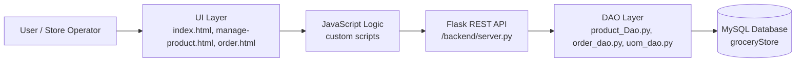
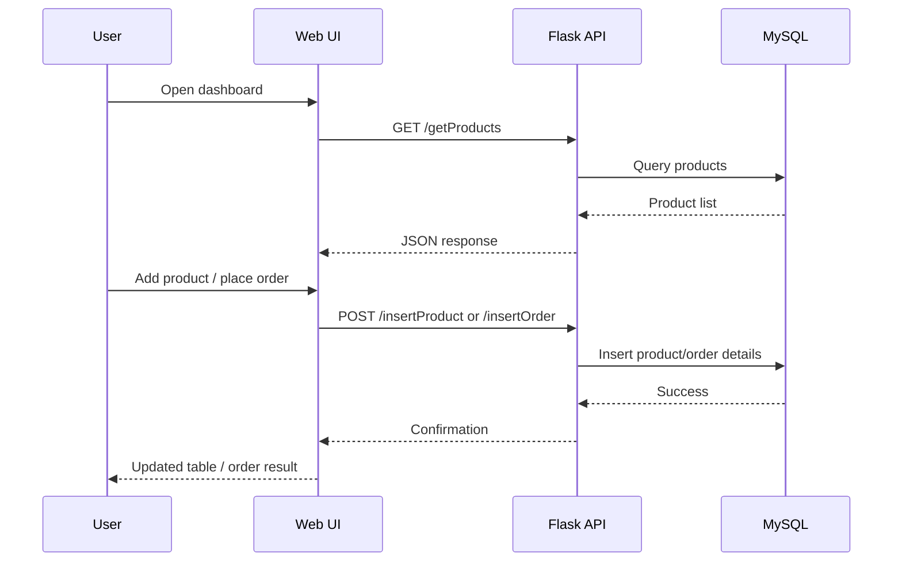
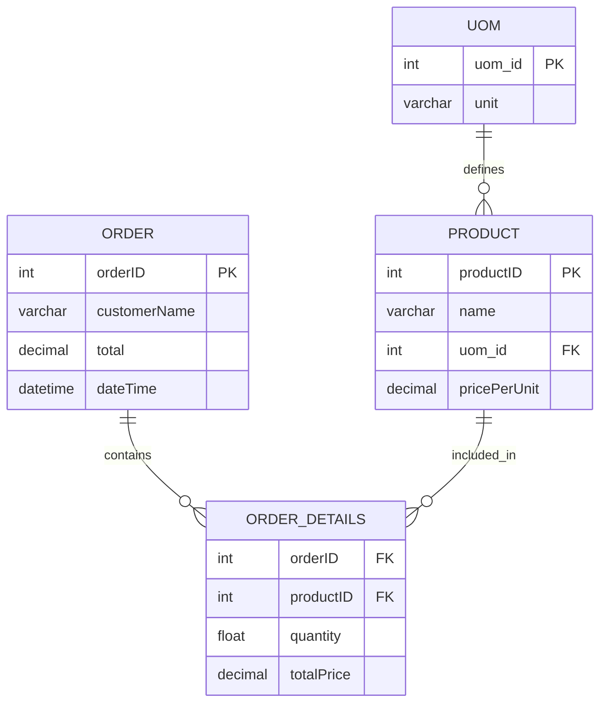

# Grocery Store Management System

A lightweight grocery store management application built with a Python Flask backend, MySQL database, and a browser-based HTML/CSS/JavaScript UI.

The project supports managing products, retrieving unit-of-measure options, creating orders, and viewing all recorded orders from a simple dashboard.

## Overview

This repository contains two major parts:

- `backend/` — Flask REST API and MySQL data access layer
- `ui/` — static web interface for product and order management

## Architecture



## Core Features

- Manage grocery inventory
- Add new products with unit information and pricing
- Remove products from the catalog
- Create customer orders with multiple items
- View orders and totals in the dashboard
- Store and retrieve data using MySQL

## Repository Structure

```text
groceryStoreApp/
├── backend/
│   ├── __pycache__/
│   ├── order_dao.py
│   ├── product_Dao.py
│   ├── server.py
│   ├── sql_connection.py
│   └── uom_dao.py
├── ui/
│   ├── css/
│   ├── images/
│   ├── js/
│   ├── index.html
│   ├── manage-product.html
│   └── order.html
├── README.md
└── .gitignore
```

## Functional Flow



## Database Model

The backend uses a MySQL database named `groceryStore` with tables for products, units, orders, and order items.



## Technology Stack

- Python 3
- Flask
- MySQL Connector for Python
- HTML5
- CSS
- JavaScript
- Bootstrap-based UI layout

## API Endpoints

The backend exposes these routes from `backend/server.py`:

- `GET /getProducts` — fetch all products
- `POST /deleteProduct` — delete a product by ID
- `GET /getUOM` — fetch available units of measure
- `POST /insertProduct` — add a product
- `POST /insertOrder` — create a new order
- `GET /getAllOrders` — fetch all orders

## Setup Instructions

### 1. Prerequisites

Install:

- Python 3.x
- MySQL Server
- `pip` package manager

### 2. Create a virtual environment

```bash
python -m venv venv
source venv/bin/activate   # On Linux/macOS
venv\Scripts\activate      # On Windows
```

### 3. Install dependencies

```bash
pip install flask mysql-connector-python
```

### 4. Configure MySQL

Create a database named `groceryStore` and ensure the connection details match `backend/sql_connection.py`:

```python
mysql.connector.connect(
    user='root',
    password='Qpzmg@123',
    host='127.0.0.1',
    database='groceryStore'
)
```

If your local MySQL settings differ, update the credentials in `backend/sql_connection.py`.

### 5. Create required tables

Use a MySQL client or script to create tables similar to:

```sql
CREATE DATABASE IF NOT EXISTS groceryStore;

USE groceryStore;

CREATE TABLE IF NOT EXISTS uom (
    uom_id INT AUTO_INCREMENT PRIMARY KEY,
    unit VARCHAR(50) NOT NULL
);

CREATE TABLE IF NOT EXISTS products (
    productID INT AUTO_INCREMENT PRIMARY KEY,
    name VARCHAR(255) NOT NULL,
    uom_id INT,
    pricePerUnit DECIMAL(10,2),
    FOREIGN KEY (uom_id) REFERENCES uom(uom_id)
);

CREATE TABLE IF NOT EXISTS orders (
    orderID INT AUTO_INCREMENT PRIMARY KEY,
    customerName VARCHAR(255),
    total DECIMAL(10,2),
    dateTime DATETIME
);

CREATE TABLE IF NOT EXISTS order_details (
    orderID INT,
    productID INT,
    quantity FLOAT,
    totalPrice DECIMAL(10,2),
    FOREIGN KEY (orderID) REFERENCES orders(orderID),
    FOREIGN KEY (productID) REFERENCES products(productID)
);
```

### 6. Run the backend

```bash
cd backend
python server.py
```

The Flask API will start on port `5000`.

### 7. Open the UI

Open the following in a browser:

```text
ui/index.html
```

You may need to serve the `ui` folder through a local web server depending on your environment, but the app is designed as a static front-end.

## Use Cases

- Add products to stock
- Manage pricing and units
- Create customer orders
- Review total sales and order history

## Notes

This project is intended as a simple, educational grocery store app and demonstrates a full-stack pattern using a static frontend, Python API layer, and relational database storage.

## License

This project does not currently include a license file. Add one if you plan to distribute or publish the app publicly.
